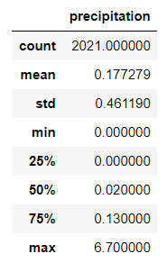
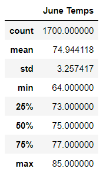
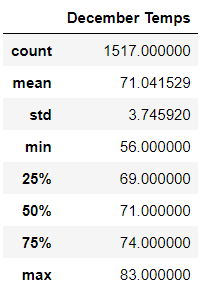

# Surfs Up Hawaii

## Background

After vacationing in Hawaii, it became clear that the island O'ahu is the perfect place to set up a destination business. With the weather and the waves, a "Surf n' Shake", is a way to make money selling surf boards/equipment and ice cream as a refreshing treat from the heat. In order to get an investor, a business plan needs to be put together. First, an analysis of the temperature and location is necessary for a good business proposal. To put the investor's mind at ease after his last business venture failed, the weather conditions for June and December are gathered. This will give an idea of the weather year round.

In order to perfom this data analysis, SQLite and SQLAlchemy were used to view the data and make queries to pull information, along with Jupyter notebook to import dependencies. 

# Resources
Data Sources: 
climate_analysis.ipynb
hawaii.sqlite

Software: 
Python 3.7.6
Jupyter Notebook 6.4.8
Ipykernel 6.9.1
Anaconda 4.13.0
SQLite
SQLAlchemy

## Results

To begin the analysis, precipitation was taken in to account in order to rule out the potential for the business to fail due to consistent rainfall. The dates for the precipitation were chosen as August 23, 2016 - August 23, 2017. During this year, the average precipitation was 17.7%. This is relatively low and shows little concern for excessive rainfall. 

The analysis of the two months provided insight on the average, minimum and maximum temperatures. 

By looking at the two tables we can see:
1) The average temperature of June is 74.944118 and the average temperature of December is 71.041529. This is less than 5 degree difference and indicitive of a stable temperature year round.
2) The minimum temperature of June is 64 degrees whereas December is 56 degrees. This is a larger difference, though the temperature still does not drop to a degree that surfers will not surf in.
3) The max temperature for June is 85 degrees and December is 83 degrees. Both of these max temperatures would bring in crowds for ice cream. 

## Summary

After reviewing all of the analyzed data, it can be concluded that O'ahu is an ideal location for the Surf n' Shake. The average precipitation is low, ruling out the possibility of the business failing from excessive rain. The average temperature between June and December are only 5 degrees different, meaning the temperature remains consistently at a good temperature for the Surf n' Shake. An average temperature that falls within 70-80 degrees is generally what most people consider ideal temperature. The maximum temperature is hot, but not uncomfortably so like 100 degrees would be. While the data does give a promising future for the business proposal, more data should be collected and analyzed. Weather changes on a yearly basis and global warming has had various different effects on the weather. One year is not enough data to get a full picture view on how the average weather of O'ahu is. One must also take in to account that this is an island and subject to harsh weather conditions, such as hurricanes. It would be beneficial to include more than one year into the analysis. Looking in to the past five years of weather data should provide a clear understanding of the weather trends and the average temperatures. 
